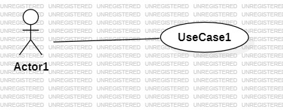
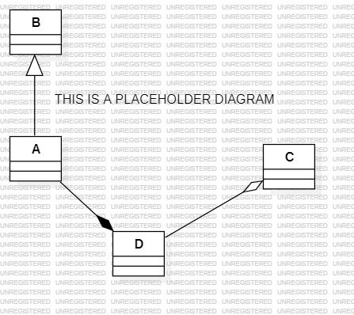
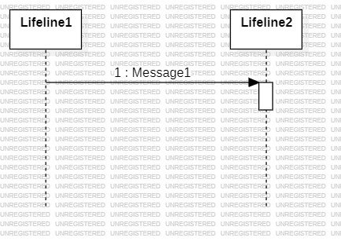
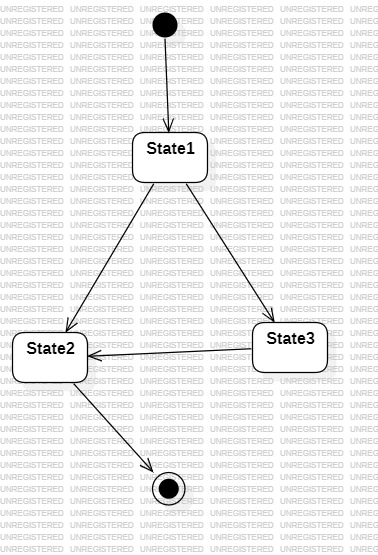
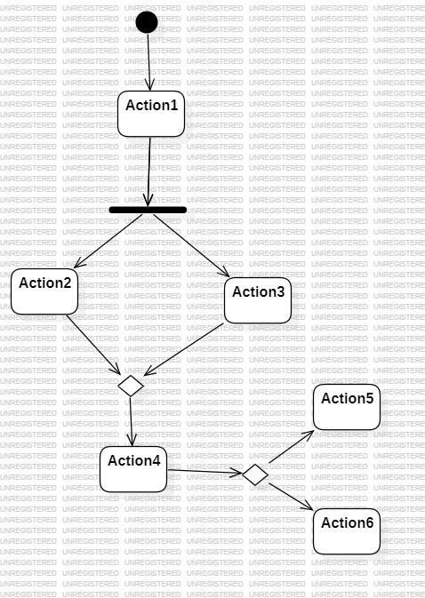

# UML Modeling for an Online Event Ticketing System

## Overview

**Brief Description:**  
In this lab, you will create UML diagrams (Use Case, Class, Sequence, State Machine, and Activity) for a hypothetical Online Event Ticketing System. These diagrams should represent the system’s functionalities, structure, and workflows.

**Key Assumptions Made (if any):**
- [List any assumptions you have made while modeling the system]

---

## Use Case Diagram

**Description:**  
Create a Use Case Diagram that identifies the main actors and use cases of the system.

- **Actors Identified:**
    - [List actors here]

- **Use Cases Identified:**
    - [List use cases here]

**Diagram:**  

---

## Class Diagram

**Description:**  
Create a Class Diagram that models the main classes, their attributes, methods, and the relationships (associations, inheritances, aggregations, compositions) between them.

- **Classes Identified:**
    - [List classes with brief descriptions]

- **Key Relationships:**
    - [List relationships among classes]

**Diagram:**  

---

## Sequence Diagram

**Description:**  
Choose one primary use case (e.g., “Purchase Ticket”) and model the interactions between objects involved in realizing that use case.

- **Selected Use Case:** [Name of use case]
- **Objects and Participants:**
    - [List objects involved]

**Diagram:**  

---

## State Machine Diagram

**Description:**  
Model the lifecycle of a Ticket within the system (e.g., from Available → Purchased → CheckedIn).

- **States Identified:**
    - [List ticket states]

- **Events/Transitions:**
    - [List events that trigger state changes]

**Diagram:**  

---

## Activity Diagram

**Description:**  
Model the workflow for a complex system process (e.g., the full workflow of purchasing a ticket and checking in at the event).

- **Main Activities:**
    - [List key activities]

- **Decisions/Forks/Merges:**
    - [Describe decision points if any]

**Diagram:**  

---

